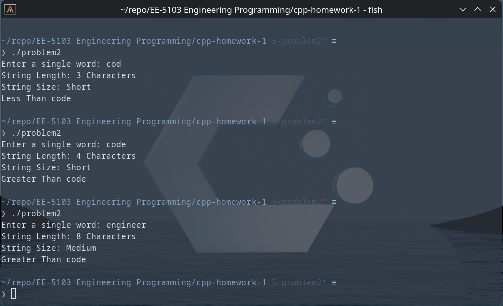
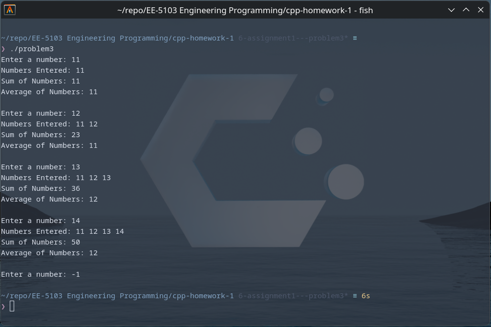

# UTSA-EE5103-Homework-Submission
### EE-5103 Engineering Programming | Assignment 1
#### Student: Jordan Cavlovic (wpx425)


### Problem 1
##### Description
Problem 1 takes in 3 integers from the user and calculates the average of the 3 temperatures.
It will output the climate for the temperatures in "Cold", "Moderate", and "Hot" depending
upon the average of the 3 input temperatures.

##### How to Run
```
git https://github.com/Jcavlovic/UTSA-EE5103-Homework-Submission.git
cd UTSA-EE5103-Homework-Submission/cpp-homework1
g++ /src/problem1.cpp -o problem1
./problem1
```

##### Output


### Problem 2
##### Description
Problem2 takes in string from the user and outputs the integer length of the string,
outputs "Short" if the string is less than 5 characters, "Medium" if the string is between
5 and 9 characters, and "Long" if greater than 8 characters. The program also outputs the
sort location of the word compared to the word "code". 

##### How to Run
```
git https://github.com/Jcavlovic/UTSA-EE5103-Homework-Submission.git
cd UTSA-EE5103-Homework-Submission/cpp-homework1
g++ /src/problem2.cpp -o problem2
./problem2
```

##### <center>Output


### Problem 3
##### Description
Problem3 takes input from the user and calculates the sum and average of the numbers, and prints the numbers
in list form to the console. The program will continue to ask for numbers until the user inputs "-1".

##### How to Run
```
git https://github.com/Jcavlovic/UTSA-EE5103-Homework-Submission.git
cd UTSA-EE5103-Homework-Submission/cpp-homework1
g++ /src/problem3.cpp -o problem3
./problem3
```

##### <center>Output
