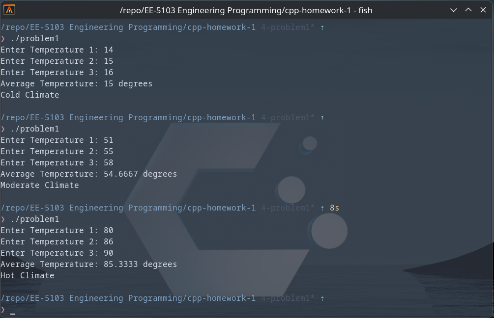

# UTSA-EE5103-Homework-Submission

## Student Name:
#### Jordan Cavlovic (wpx425)

### EE-5103 Engineering Programming
#### Assignment 1

### Description
##### Problem 1
Problem 1 takes in 3 integers from the user and calculates the average of the 3 temperatures.
It will output the climate for the temperatures in "Cold", "Moderate", and "Hot" depending
upon the average of the 3 input temperatures.

##### How to Run
```
git https://github.com/Jcavlovic/UTSA-EE5103-Homework-Submission.git
cd UTSA-EE5103-Homework-Submission/cpp-homework1
g++ /src/problem1.cpp -o problem1
./problem1
```

##### Output

