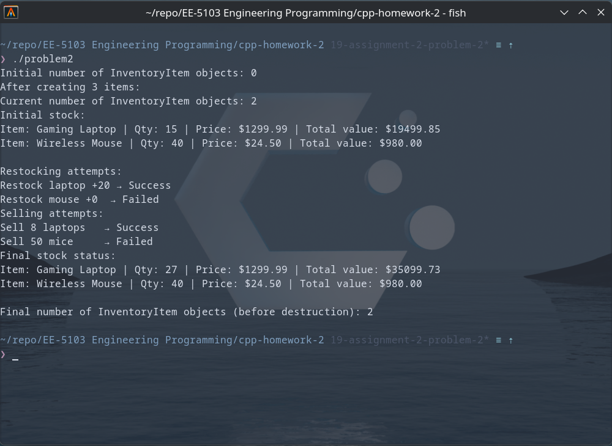
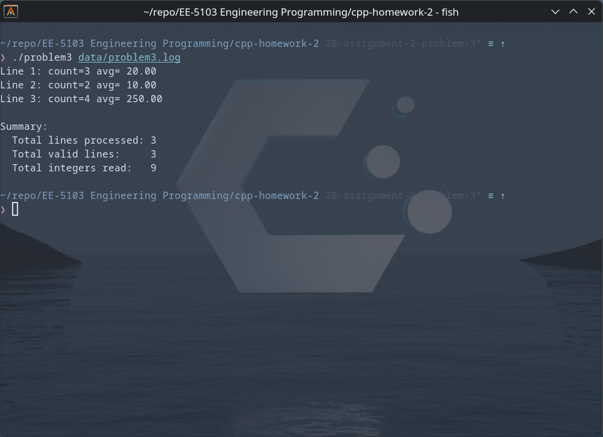
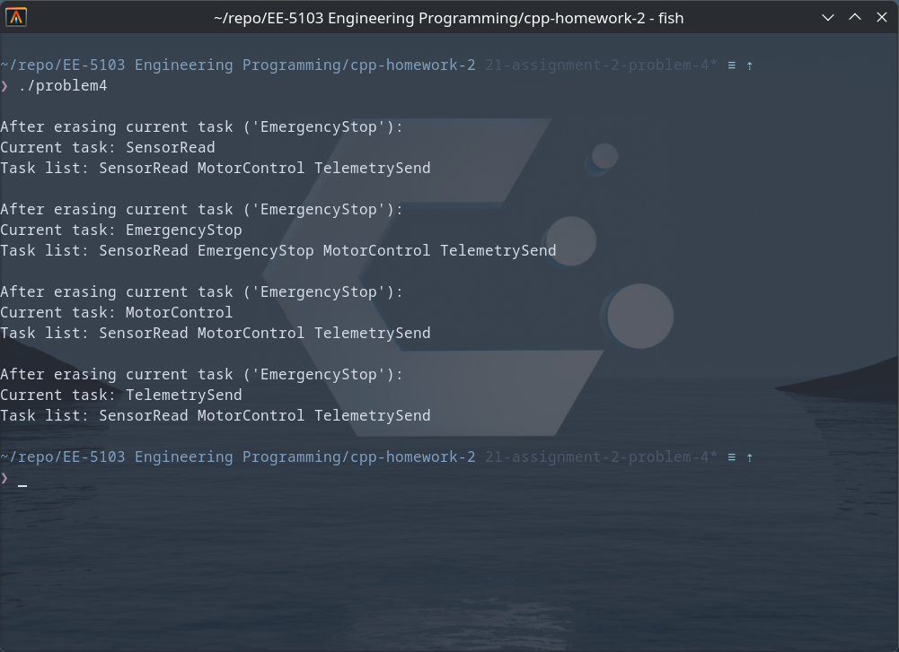
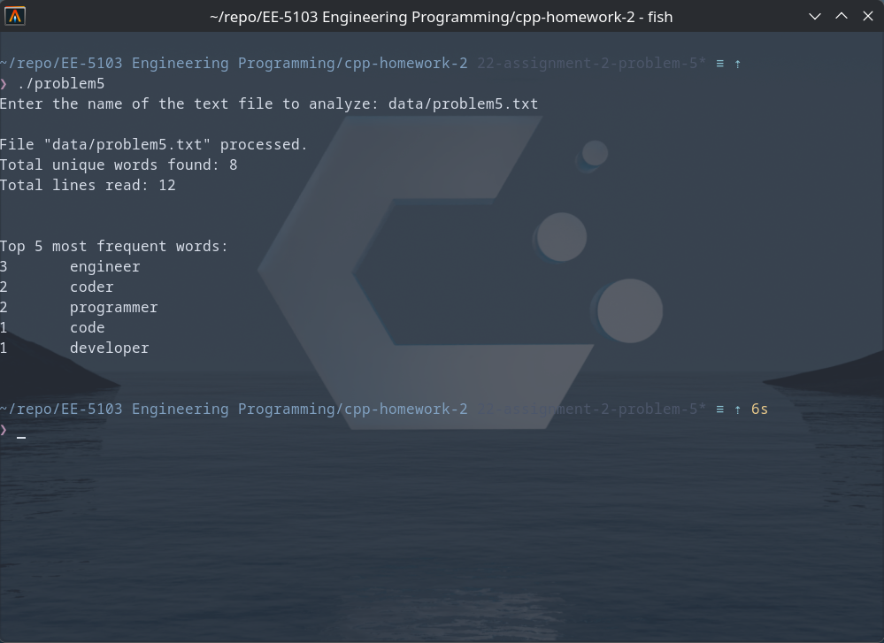

# UTSA-EE5103-Homework-Submission
### EE-5103 Engineering Programming | Assignment 2
#### Student: Jordan Cavlovic (wpx425)

### Problem 1
##### Description
Problem 1 takes inputs from the user between 0 - 500. It will determine if the input is valid,
if input is valid it will increment count by 1, update the minimum value, maximum value, sum, and average.
It will print to console the count, min value, max value, and average.

##### How to Run
```
git https://github.com/Jcavlovic/UTSA-EE5103-Homework-Submission.git
cd UTSA-EE5103-Homework-Submission/cpp-homework-2
g++ /src/problem1.cpp -o problem1
./problem1
```

##### Output


### Problem 2
##### Description
Problem 2 is an inventory system for an electronic store. It allows the store
to create objects for new items, restock items, and sell items. It will calculate
the total value for each object and keep track of total number of different objects.

##### How to Run
```
git https://github.com/Jcavlovic/UTSA-EE5103-Homework-Submission.git
cd UTSA-EE5103-Homework-Submission/cpp-homework-2
g++ /src/problem2.cpp -o problem2
./problem2
```

##### Output


### Problem 3
##### Description
Problem 3 reads lines of integers from a log file and
outputs the average of the line, totals lines read, total valid lines,
and total integers read.
AI was used to assist with this task.

##### How to Run
```
git https://github.com/Jcavlovic/UTSA-EE5103-Homework-Submission.git
cd UTSA-EE5103-Homework-Submission/cpp-homework-2
g++ /src/problem3.cpp -o problem3
./problem3 data/problem3.log
AI was used to assist with this task.
```

##### Output


### Problem 4
##### Description
Problem 4 implements a task scheduler using a list of strings.
It updates the scheduler, by inserting and erasing without 
affecting the current task.

##### How to Run
```
git https://github.com/Jcavlovic/UTSA-EE5103-Homework-Submission.git
cd UTSA-EE5103-Homework-Submission/cpp-homework-2
g++ /src/problem4.cpp -o problem4
./problem4
```

##### Output


### Problem 5
##### Description
Problem 5 reads a text file of words and outputs how many times
each word appears, and the 5 most frequent words.

##### How to Run
```
git https://github.com/Jcavlovic/UTSA-EE5103-Homework-Submission.git
cd UTSA-EE5103-Homework-Submission/cpp-homework-2
g++ /src/problem5.cpp -o problem5
./problem5 data/problem5.txt
```

##### Output
