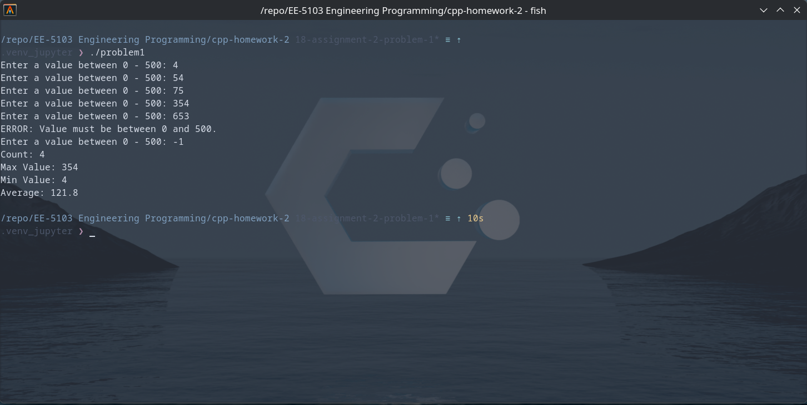

# UTSA-EE5103-Homework-Submission
### EE-5103 Engineering Programming | Assignment 2
#### Student: Jordan Cavlovic (wpx425)

### Problem 1
##### Description
Problem 1 takes inputs from the user between 0 - 500. It will determine if the input is valid,
if input is valid it will increment count by 1, update the minimum value, maximum value, sum, and average.
It will print to console the count, min value, max value, and average.

##### How to Run
```
git https://github.com/Jcavlovic/UTSA-EE5103-Homework-Submission.git
cd UTSA-EE5103-Homework-Submission/cpp-homework-2
g++ /src/problem1.cpp -o problem1
./problem1
```

##### Output
