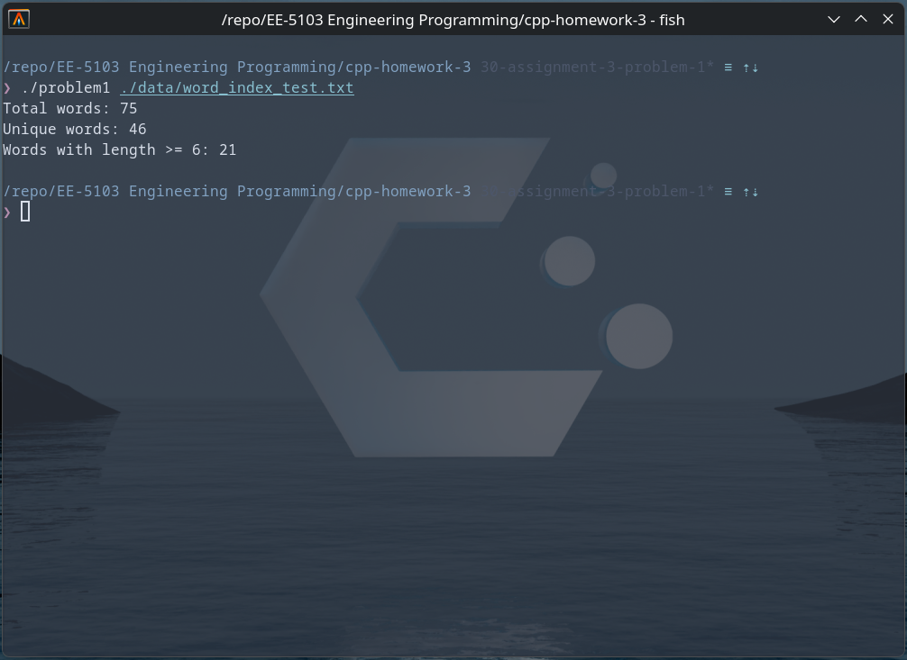

# UTSA-EE5103-Homework-Submission
### EE-5103 Engineering Programming | Assignment 3
#### Student: Jordan Cavlovic (wpx425)

### Problem 1
##### Description
This program reads a text file specified on the command line and analyzes word usage using only STL algorithms. It stores all words in a vector, normalizes them by converting to lowercase and removing punctuation, then sorts the data and removes duplicates. The program also computes statistics including the total number of words, the number of unique words, and how many words have a length of at least six characters, and finally prints these results.

##### How to Run
```
git https://github.com/Jcavlovic/UTSA-EE5103-Homework-Submission.git
cd UTSA-EE5103-Homework-Submission/cpp-homework-3
g++ /src/problem1.cpp -o problem1
./problem1 ./data/word_index_test.txt
```

##### Output


### Problem 2
##### Description
This program reads a text file specified on the command line and analyzes word usage using only STL algorithms. It stores all words in a vector, normalizes them by converting to lowercase and removing punctuation, then sorts the data and removes duplicates. The program also computes statistics including the total number of words, the number of unique words, and how many words have a length of at least six characters, and finally prints these results.

##### How to Run
```
git https://github.com/Jcavlovic/UTSA-EE5103-Homework-Submission.git
cd UTSA-EE5103-Homework-Submission/cpp-homework-3
g++ /src/problem2.cpp -o problem2
./problem2 ./data/word_index_test.txt
```

##### Output

