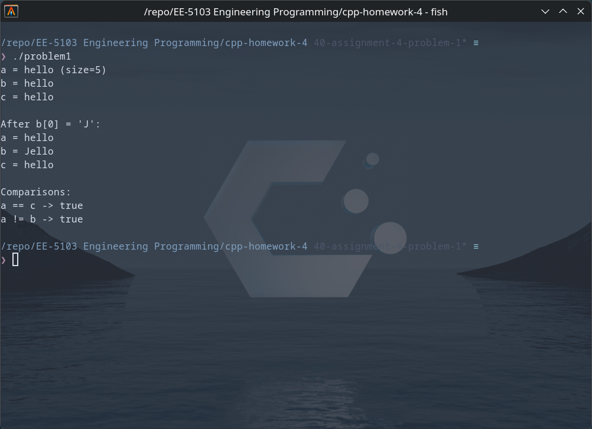
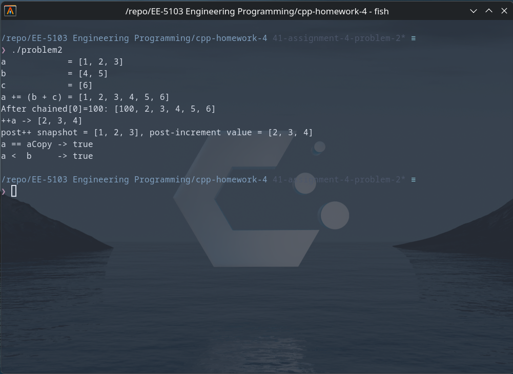
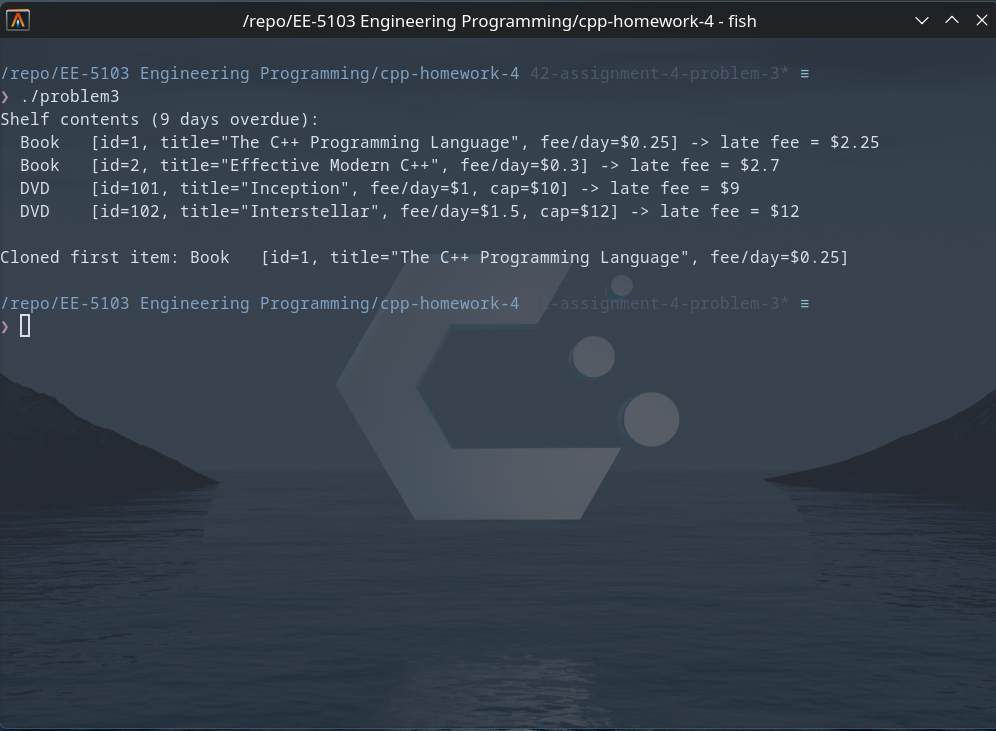
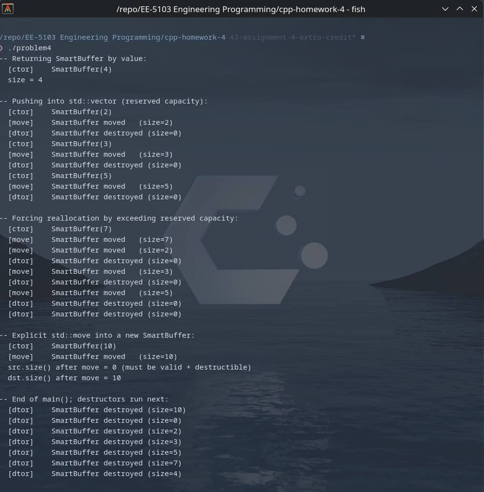

# UTSA-EE5103-Homework-Submission
### EE-5103 Engineering Programming | Assignment 4
#### Student: Jordan Cavlovic (wpx425)

### Problem 1
##### Description
 Implements a SimpleString class that manages a dynamically allocated
 character array and behaves like a value type. Because the class owns
 raw memory through a char*, the synthesized copy-control members are
 insufficient (they would alias the same buffer). This implementation
 supplies a copy constructor, copy-assignment operator (using the
 copy-and-swap idiom for strong exception safety), and a destructor
 that together guarantee deep-copy semantics. Operators <<, ==, !=,
 and both const and non-const subscript operators are also overloaded.

##### How to Run
```
git https://github.com/Jcavlovic/UTSA-EE5103-Homework-Submission.git
cd UTSA-EE5103-Homework-Submission/cpp-homework-4
g++ /src/problem1.cpp -o problem1
./problem1
```

##### Output


 ### Problem 2
##### Description
 Implements NumberList, a dynamically sized container of integers that
 focuses on operator semantics rather than user-defined conversions or
 callable objects. NumberList manages its own heap-allocated int array
 with explicit copy-control members (copy constructor, copy-assignment,
 destructor)

##### How to Run
```
git https://github.com/Jcavlovic/UTSA-EE5103-Homework-Submission.git
cd UTSA-EE5103-Homework-Submission/cpp-homework-4
g++ /src/problem2.cpp -o problem2
./problem2
```

##### Output


  ### Problem 3
##### Description
 Models a small library checkout system. LibraryItem is an abstract
 base class (it declares two pure virtual functions, lateFee and
 clone, plus a virtual destructor) so it cannot be instantiated
 directly. Two concrete derivatives are provided:
  - Book : flat per-day late fee
  - DVD  : higher per-day fee, capped at a maximum amount

##### How to Run
```
git https://github.com/Jcavlovic/UTSA-EE5103-Homework-Submission.git
cd UTSA-EE5103-Homework-Submission/cpp-homework-4
g++ /src/problem3.cpp -o problem3
./problem3
```

##### Output


### Problem 4
##### Description
 Implements SmartBuffer, a class that owns a heap-allocated array of
 doubles and fully supports both copy and move semantics. Each
 special member prints a diagnostic so the demonstration in main()
 makes it obvious when an operation triggers a copy versus a move.
 
 After a move, the source object's pointer is reset to nullptr and
 its size is zeroed - it remains in a valid, destructible state but
 no longer owns any memory.

##### How to Run
```
git https://github.com/Jcavlovic/UTSA-EE5103-Homework-Submission.git
cd UTSA-EE5103-Homework-Submission/cpp-homework-4
g++ /src/problem4.cpp -o problem4
./problem4
```

##### Output
